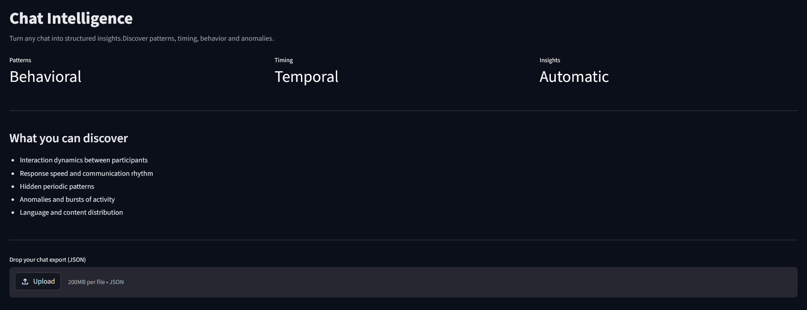

# 💬 Chat Intelligence

A sophisticated, self-hosted analytics platform that transforms chat exports into comprehensive behavioral, temporal, and content-based insights. Built with a modular strategy pattern architecture for extensible analysis capabilities.



## 🎯 Overview

Chat Intelligence is an open-source solution that works with any structured chat JSON export, providing deep analytics without platform dependencies. Whether you're analyzing group dynamics, communication patterns, or content trends, this platform delivers actionable insights through interactive visualizations.

## ✨ Key Features

### 📊 **Behavioral Analysis**
- **Dominance Index**: Measure participant influence and control in conversations
- **Engagement Metrics**: Visualize participation patterns through pie charts
- **Response Time Analysis**: Track communication latency and responsiveness

### ⏱️ **Temporal Pattern Recognition**
- **Weekly/Monthly Trends**: Identify recurring communication cycles
- **Moving Averages**: Smooth out noise to reveal underlying patterns
- **Periodicity Heatmaps**: Discover optimal communication times and patterns
- **Filterable Timeline**: Interactive exploration of message flow over time

### 🔍 **Content Intelligence**
- **Word Frequency Analysis**: Identify trending topics and vocabulary patterns
- **Content Classification**: Automatic categorization of message themes
- **Anomaly Detection**: Spot unusual spikes or patterns in communication

### 📈 **Advanced Analytics**
- **Peak Detection**: Automatically identify significant conversation peaks
- **Time Series Analysis**: Comprehensive temporal data exploration
- **Interactive Visualizations**: Dynamic charts with filtering and zoom capabilities

## 🏗️ Architecture

The platform follows a clean, modular architecture designed for scalability and maintainability:

### **Frontend Layer**
- **Streamlit Dashboard**: Single-page application with intuitive UI
- **Real-time Updates**: Dynamic chart rendering based on user interactions
- **Responsive Design**: Optimized for various screen sizes

### **Analytics Engine**
- **Strategy Pattern**: Modular chart strategies for easy extension
- **Lazy Loading**: Efficient data processing with on-demand computation
- **Caching Layer**: Optimized performance through intelligent caching

### **Data Pipeline**
- **Universal Parser**: Platform-agnostic chat data ingestion
- **Structured Processing**: Clean data transformation and normalization
- **Error Handling**: Robust parsing with comprehensive error reporting

## 🚀 Quick Start

### **Local Development**

1. **Install uv (Python package manager)**
   ```bash
   curl -Ls https://astral.sh/uv/install.sh | sh
   ```

2. **Clone and setup the project**
   ```bash
   git clone <repository-url>
   cd chatIntelligence
   uv sync
   ```

3. **Launch the application**
   ```bash
   uv run streamlit run src/app.py
   ```

### **Docker Deployment**

**Option 1: Pull from GitHub Container Registry**
```bash
# Pull the latest pre-built image
docker pull ghcr.io/netphantom/chatintelligence:latest

# Run the application
docker run -p 8501:8501 ghcr.io/netphantom/chatintelligence:latest
```

**Option 2: Build locally**
```bash
# Build the container
docker build -t chat-intelligence .

# Run the application
docker run -p 8501:8501 chat-intelligence
```

## 📂 Project Structure

```
chatIntelligence/
├── src/
│   ├── app.py                    # Main application entry point
│   ├── controller/
│   │   ├── TelegramParser.py     # Chat data parsing logic
│   │   └── __init__.py
│   └── view/
│       ├── DashboardApp.py       # Streamlit dashboard implementation
│       ├── charts/
│       │   ├── ChartStrategy.py          # Base strategy interface
│       │   ├── DominanceIndexStrategy.py # Dominance analysis
│       │   ├── EngagementPieStrategy.py  # Engagement visualization
│       │   ├── FilterableTimelineStrategy.py # Interactive timeline
│       │   ├── MovingAverageStrategy.py  # Trend analysis
│       │   ├── PeakAnomalyStrategy.py    # Anomaly detection
│       │   ├── PeriodicityHeatmapStrategy.py # Time pattern analysis
│       │   ├── ResponseTimeStrategy.py   # Response time metrics
│       │   ├── TimeSeriesPlotStrategy.py # Basic time series
│       │   ├── WordFrequencyStrategy.py # Content analysis
│       │   └── __init__.py
│       └── __init__.py
├── pyproject.toml               # Project configuration and dependencies
├── Dockerfile                   # Container build configuration
├── .github/
│   └── workflows/
│       └── deploy.yml           # CI/CD pipeline
├── README.md                    # This documentation
└── LICENSE                      # MIT License
```

## ⚙️ Configuration

### **Environment Variables**
No environment variables required for basic operation.

### **Optional Configuration**
- **Logging Level**: Control verbosity of application logs
- **Cache Settings**: Tune performance parameters (future feature)
- **Chart Defaults**: Customize visualization preferences

## 🧠 Design Principles

- **Strategy Pattern**: Extensible analytics modules for easy feature addition
- **Separation of Concerns**: Clear distinction between UI, logic, and data layers
- **Stateless Execution**: Efficient resource usage with minimal memory footprint
- **Lazy Evaluation**: Compute analytics only when needed
- **Modular Architecture**: Independent components for maintainability

## 🔧 Technical Stack

- **Frontend**: Streamlit for rapid web application development
- **Backend**: Python 3.13+ with modern async capabilities
- **Data Processing**: Pandas for efficient data manipulation
- **Visualization**: Plotly for interactive, publication-quality charts
- **Package Management**: uv for fast, reliable dependency management

## 🚀 Roadmap

### **Near Future**
- [ ] AI-powered conversation summaries
- [ ] PDF report generation
- [ ] Real-time streaming analysis
- [ ] Multi-chat comparison dashboard

### **Long-term Vision**
- [ ] Advanced sentiment analysis
- [ ] Custom chart strategy builder
- [ ] Integration with popular chat platforms
- [ ] Team collaboration features

## 🤝 Contributing

We welcome contributions! Please see our contributing guidelines for details on:
- Code style and standards
- Testing requirements
- Pull request process
- Issue reporting

## 📄 License

This project is licensed under the MIT License - see the [LICENSE](LICENSE) file for details.
